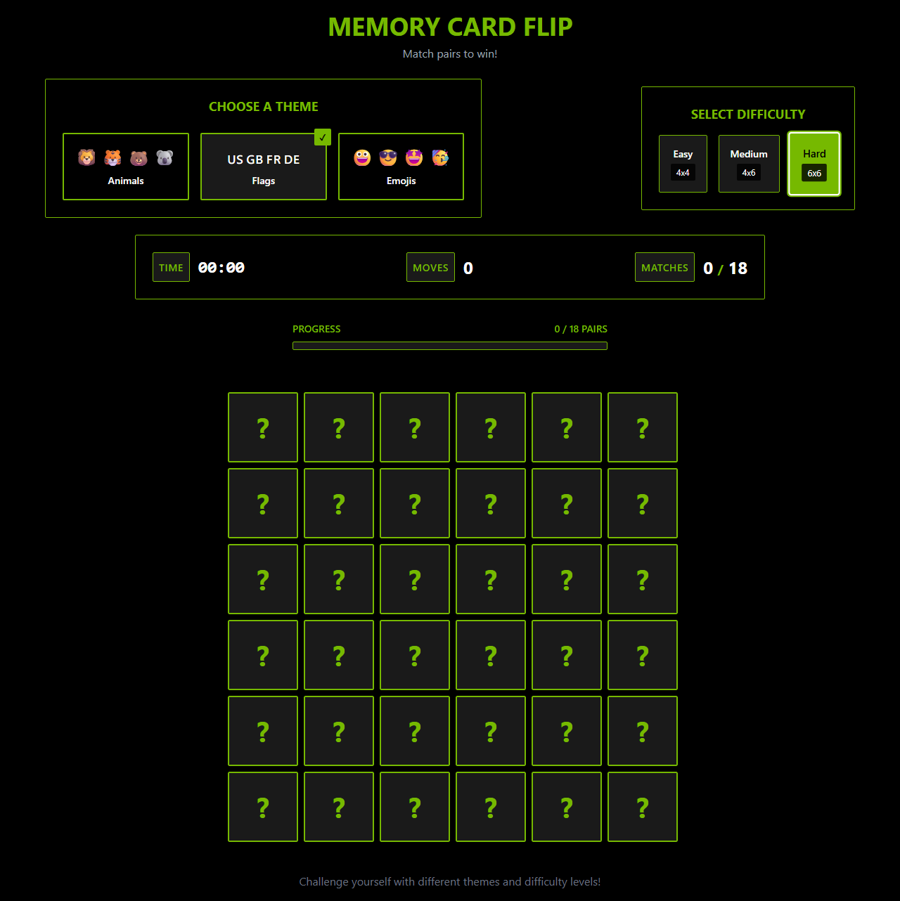
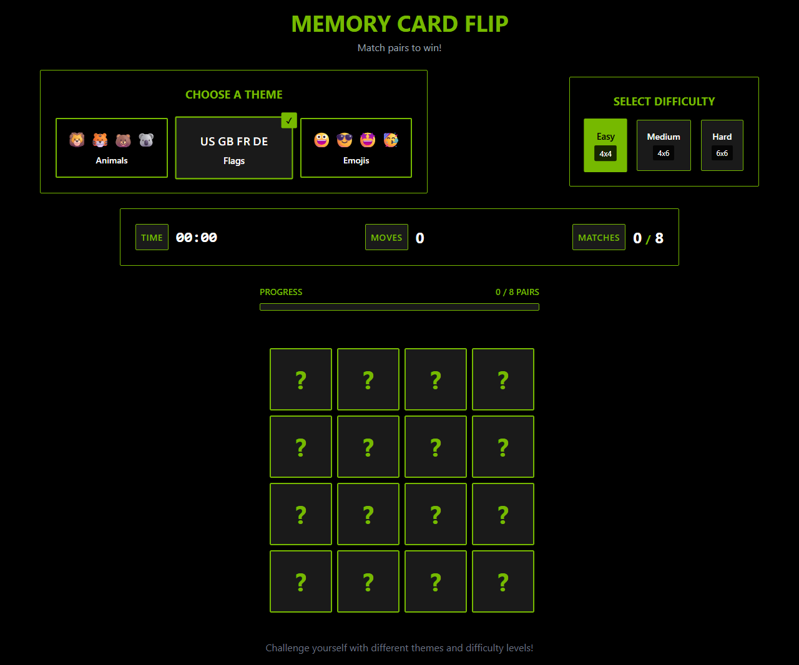

<div align="center">

# Memory Card Flip

**A card-matching memory game built entirely by AI — powered by the NVIDIA DESIGN.md dark theme.**




</div>

---

## What Is This?

This is a **test project** built by [Autobots](https://github.com/DanielDeshmukh/autobots) using the **Mark II pipeline** — a dual-model collaboration system where one AI model generates code and another reviews it before writing.

**No human wrote any code in this project.** Every component, style, and game logic file was generated by AI. The project also uses a [DESIGN.md](https://getdesign.md) file for NVIDIA's design system, applied automatically by the swarm.

## Features

- **Card Matching** — flip cards to find matching pairs
- **3 Themes** — Animals, Flags (Unicode emoji), and Emojis
- **3 Difficulties** — Easy (4x4), Medium (4x6), Hard (6x6)
- **Live Stats** — timer, move counter, and match tracker
- **Progress Bar** — visual progress toward completing the puzzle
- **Celebration** — win detection with celebration overlay
- **NVIDIA Theme** — dark canvas (#000000) with green accent (#76B900)



## Tech Stack

| Layer | Technology |
|-------|-----------|
| Framework | React 19 |
| Language | TypeScript 5.7 |
| Build Tool | Vite 6 |
| Styling | Tailwind CSS 3 + custom CSS |
| State | Zustand |
| Design System | NVIDIA DESIGN.md |

## How Autobots Built This

This project was generated using the **Mark II pipeline** — a more advanced orchestration system with dual-model collaboration:

```
User Prompt: "Build a memory card flip game"
                    ↓
            ┌───────────────┐
            │   Planner     │  Decomposes into subtasks
            │  (Qwen-80b)   │  assigns model pairs per task
            └───────┬───────┘
                    ↓
            ┌───────────────┐
            │   Generator   │  Creates initial code
            │  (Qwen-122b)  │
            └───────┬───────┘
                    ↓
            ┌───────────────┐
            │   Reviewer    │  Reviews for bugs, cross-file
            │  (Qwen-80b)   │  inconsistencies, missing exports
            └───────┬───────┘
                    ↓
            ┌───────────────┐
            │   Repair      │  TypeScript validation, import
            │  (Qwen-80b)   │  path fixes, missing files
            └───────┬───────┘
                    ↓
            27+ files generated per iteration
```

### Results

| Metric | Value |
|--------|-------|
| Files generated | 27+ |
| Pipeline runs | 7+ |
| Manual fixes required | ~10 |
| Models used | Qwen-122B + Qwen-80B |
| Design system | NVIDIA DESIGN.md |

## Problems Faced & Fixed

The Mark II pipeline encountered several issues during generation. Here's what went wrong and how each was resolved:

### 1. Timer Showed `NaN:NaN`
**Problem**: The `gameStore` used `timer` but `StatsBar` read `timeElapsed` — two different property names for the same value.

**Fix**: Aligned all components to use `timeElapsed` consistently across the store and UI.

### 2. Cards Rendered as Tiny Squares
**Problem**: The pipeline generated cards using `framer-motion` for animations, but the package wasn't installed. Cards had no explicit sizing and collapsed to minimal dimensions.

**Fix**: Replaced `framer-motion` with pure CSS flip animations. Added explicit `aspect-ratio: 1` and grid-based sizing.

### 3. Cards Didn't Flip on Click
**Problem**: `initializeGame()` was never called on mount, leaving the cards array empty. The `flipCard` function returned early because `isPlaying` was `false` and no cards existed.

**Fix**: Added `useEffect` in `App.tsx` to call `initializeGame()` on mount. Fixed the `isPlaying` state logic to start on first click.

### 4. 6x6 Grid Showed 32 Cards Instead of 36
**Problem**: `generateCards()` used `themeItems.slice(0, count/2)`. For 6x6, it needed 18 unique items, but themes only had 16. `slice(0, 18)` returned 16, doubled to 32.

**Fix**: Increased each theme to 18+ items and added cycling logic for when more unique items are needed than available.

### 5. Flags Theme Showed Text Instead of Emojis
**Problem**: The flag emoji Unicode characters weren't rendering as colored flag icons in the headless environment.

**Fix**: Replaced with standard Unicode flag emojis that render correctly across browsers with emoji font support.

### 6. Missing PostCSS Config
**Problem**: Tailwind CSS wasn't processing because `postcss.config.js` didn't exist.

**Fix**: Added `postcss.config.cjs` with Tailwind plugin (`.cjs` extension required due to `"type": "module"` in package.json).

### 7. Cross-File Contract Mismatches
**Problem**: Parallel workers generated files independently. Component A expected properties that Component B didn't export.

**Fix**: Used single-worker approach with full file context — one model sees all files and generates consistent code.

## Project Structure

```
memory-card-flip/
├── src/
│   ├── components/
│   │   ├── Card.tsx + Card.css       # Individual card with CSS flip
│   │   ├── GameGrid.tsx              # Card grid layout
│   │   ├── StatsBar.tsx              # Timer, moves, matches
│   │   ├── ProgressBar.tsx           # Completion progress
│   │   ├── ThemeSelector.tsx         # Theme picker (Animals/Flags/Emojis)
│   │   ├── DifficultySelector.tsx    # Grid size picker (4x4/4x6/6x6)
│   │   └── Celebration.tsx           # Win overlay
│   ├── store/
│   │   └── gameStore.ts              # Zustand state management
│   ├── data/
│   │   └── themes.ts                 # Theme definitions + emoji data
│   ├── constants/
│   │   └── index.ts                  # Difficulty configs + colors
│   ├── types/
│   │   └── index.ts                  # TypeScript interfaces
│   ├── App.tsx                       # Root component
│   └── main.tsx                      # Entry point
├── DESIGN.md                         # NVIDIA design system analysis
├── index.html
├── package.json
├── tailwind.config.js
├── postcss.config.cjs
├── tsconfig.json
└── vite.config.ts
```

## Design System

This project uses [NVIDIA's DESIGN.md](https://getdesign.md/nvidia/design-md) from the [getdesign.md](https://getdesign.md) collection — a production-grade design analysis applied automatically by the AI swarm.

| Token | Value | Usage |
|-------|-------|-------|
| Primary | `#76B900` | NVIDIA Green — CTAs, borders, active states |
| Surface | `#000000` | Pure black canvas background |
| Elevated | `#1A1A1A` | Card backs, hover states |
| Radius | `2px` | Angular, precise design language |
| Font | Bold sans-serif | Display headings, stats |

## Getting Started

```bash
# Install dependencies
npm install

# Start dev server
npm run dev

# Build for production
npm run build
```

## Why This Matters

This project demonstrates the Mark II pipeline's ability to:
- Generate complex interactive UIs with game logic
- Apply design systems from DESIGN.md files
- Handle cross-component state management
- Recover from generation bugs through iterative repair

It also exposes the current limitations of multi-model swarms:
- Parallel workers can produce inconsistent code
- Complex state logic requires multiple repair iterations
- CSS animations need explicit constraints (no framer-motion)

These insights drive improvements in the Autobots engine.

## Links

- **Autobots Engine**: [github.com/DanielDeshmukh/autobots](https://github.com/DanielDeshmukh/autobots)
- **NVIDIA DESIGN.md**: [getdesign.md/nvidia](https://getdesign.md/nvidia/design-md)
- **PyPI Package**: `pip install autobot-swarm`

---

<div align="center">

Built with [Autobots](https://github.com/DanielDeshmukh/autobots) — multi-model AI coding swarm

</div>
